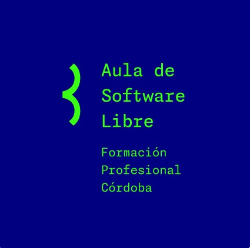

  

###

<h1 align="left">Hola 👋 Quienes somos?</h1>

###

Somos el Aula de software libre de la FP de Córdoba... y venimos a darlo todo...

###

<h2 align="left">About me</h2>

###

✨ Viva el desarrollo libre de software ... 📚 Actualmente nos estamos formando ... 🎯 Objetivos: desarrollar software libre y mejorar como programadores ...

###

<h2 align="left">Hacemos código con</h2>

###

  
  
  
  
  
  
  
  
  
  
  
  
  
  
  
  
  
  
  
  
  
  
  
  
  
  
  
  
  

###

  

###
