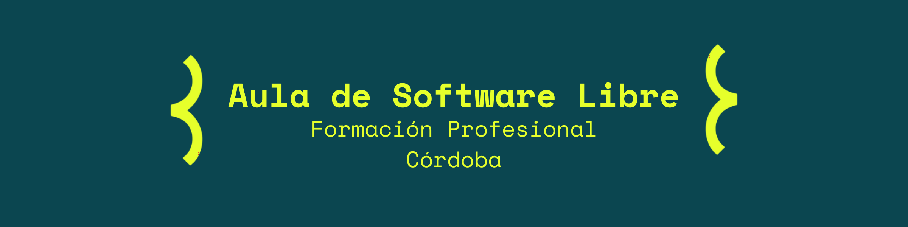

  

###

<h1 align="left">Hola 👋 Quienes somos?</h1>

###

Somos el Aula de software libre de la FP de Córdoba... y venimos a darlo todo...

# 💫 About Me:
¡Hola! Somos un grupo de estudiantes del Grado Superior en Desarrollo de Aplicaciones Multiplataforma (DAM), apasionados por la tecnología y el software libre. Nos hemos unido para crear un aula dedicada al aprendizaje y la promoción de herramientas y aplicaciones de código abierto.

Nuestro objetivo es fomentar un entorno colaborativo donde podamos desarrollar proyectos innovadores, compartir conocimientos y contribuir a la comunidad de software libre. Creemos que la tecnología debe ser accesible para todos, y estamos comprometidos a explorar y crear soluciones que impacten positivamente a nuestra sociedad.

¡Únete a nosotros en esta emocionante aventura hacia un futuro más libre y colaborativo! 🧑🏻‍💻

## 🌐 Socials:
  

# 💻 Tech Stack:
                         

# 📊 GitHub Stats:

<b>My GitHub Stats</b>

|   |   |
|---|---|
| 
 |  |
